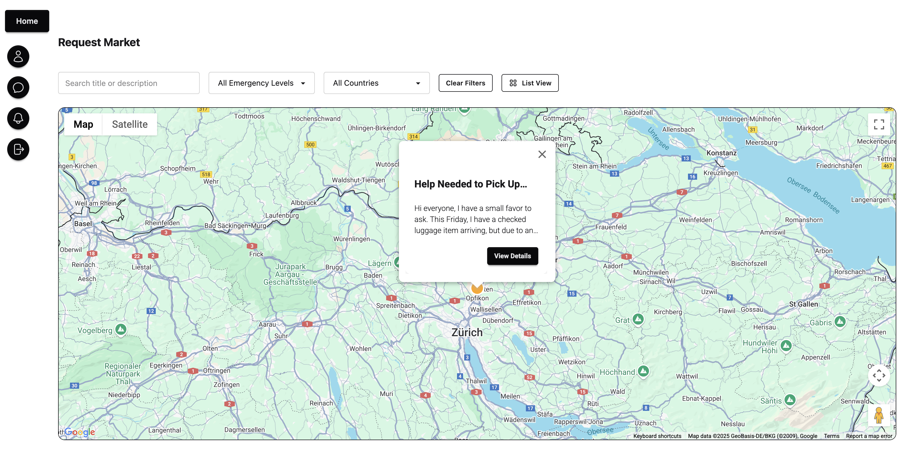
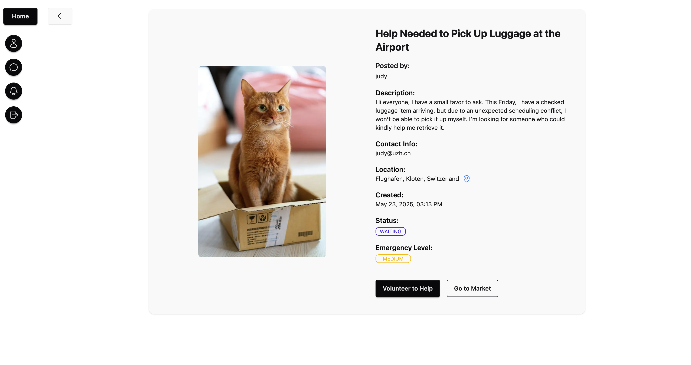
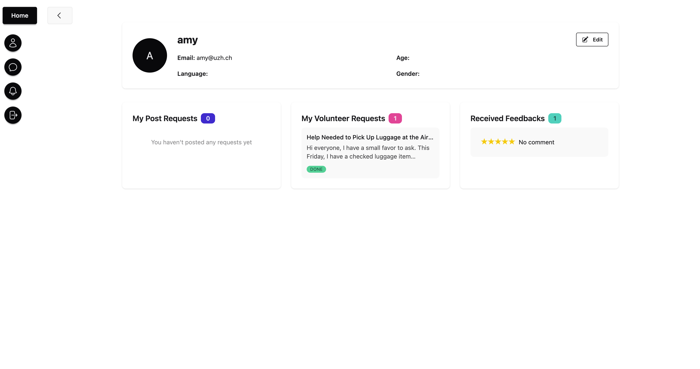

# KindBridge

## Introduction

KindBridge is a community-driven platform designed to connect students who need help with those willing to lend a hand. Many students face difficulties in finding accessible opportunities to contribute to social causes or get help with everyday tasks, such as pet care, airport pickups, or advice on student life abroad. Our motivation is to provide a transparent, efficient, and user-friendly platform that bridges the gap between those who need help and those who can offer it, promoting kindness and support within the student community. 

## Technologies

- **Google Places API (Autocomplete)** – To assist users in finding and selecting locations accurately and efficiently.
- **Google Maps JavaScript API** – To display interactive maps and visualize requests' locations in the interface.
  

## High-level components

-  **Request Market**
   - **Role**: Displays all available requests and features an interactive map using the Google Maps JavaScript API, allowing users to view request locations.
   - **Key File**: [`RequestsMap.tsx`](app/components/RequestsMap.tsx)
   - **Related To**: `Request` (request info)

- **Request**
   - **Role**: Represents the details of a request. Allows users to view profiles of both the request creator and volunteer. Additionally, it can open Google Maps based on the selected location.
   - **Key File**: [`Request`](app/requests/[id]/page.tsx)
   - **Related To**: `Request Market` , `Profile` (user info)
  
- **Profile**
   - **Role**: Displays a user's basic information and shows their request history and feedback.
   - **Key File**: [`Profile`](app/users/[id]/page.tsx)
   - **Related To**: `Request` (creator/volunteer info), `Notification`

- **Notification**
   - **Role**: Manages notifications related to user activities, informing users of status changes in their requests. It also provides interactive buttons to manage requests.
   - **Key File**: [`notification`](app/notifications/page.tsx)
   - **Related To**: `Message`, `Request`, `Profile`

- **Message**
   - **Role**: Facilitates communication between users.
   - **Key File**: [`ChatPanel`](app/components/ChatPanel.tsx), [`ContactList`](app/components/ContactList.tsx)
   - **Related To**: `Request`, `Notification`, `Profile`

## Launch & Deployment
To get started with the application, follow these steps:

1. **Clone the Repository**:
   Clone the repository to your local machine using the following command:
   ```bash
   git clone https://github.com/rwen-ds/sopra-fs25-group-03-client.git
   ```
2. **Install Dependencies**: 
    Navigate to the project directory and install the necessary dependencies:
    ```bash
   npm install
   ```
3. **Run the Application Locally**:
   To start the project, use the following command:
    ```bash
   npm run dev
   ```
4. **Build the Project**:
   To build the project for production, run:
   ```bash
   npm run build
   ```
5. **Deployment**:
   There are no additional dependencies or databases required to run the project locally. Once your changes are pushed to the GitHub repository, they will automatically trigger the deployment process.

## Illustrations

In our platform, the main user flow involves several key actions and interactions across various sections. Below is a brief description of the flow:

1. **Register**:
   - Users can register using their academic email address. The backend only allows emails containing uzh, ethz, edu, or stu in the domain.

2. **Post Request**: 
   - Users can create a new request by posting it in the **Post Request**. The request includes details such as the title, description and location.

3. **Manage Requests**:
   - After posting a request, users can view and manage their requests in the **My Requests** section. Here, they can edit, delete, or track the status of their requests.

4. **Request Market**:
   - **Available Requests**: Other users can browse the **Request Market** to view available requests. They can see the request details, the distance from their current location (if provided), and an interactive map showing the request’s location.
   - **Request Details**: Clicking on a request will take users to the **Request Detail** page, where they can see more information and interact with the creator’s profile by clicking on the creator's name.

5. **Map View**:
   - If the user has provided a location, they can click on the map pin next to the request's location, which will open **Google Maps** for detailed navigation and location interaction.

6. **Volunteer Interaction**:
   - Volunteers can choose to volunteer for a request directly from the **Request Detail** page by clicking the "Volunteer to Help" button.
   - Upon volunteering, they will receive a notification, which can be accepted by the user who posted the request.

7. **Marking Completion**:
   - Once the volunteer has completed their task, they can mark it as completed. The user who posted the request can then mark it as "Done" and provide feedback.

8. **Feedback**:
   - Users can leave feedback for volunteers after the completion of the task. This feedback will be displayed on the user’s **Profile** page.

9.  **Admin Panel**:
   - An **Admin Interface** is provided for administrative users. Here, administrators can edit user information, manage requests, delete users, or remove requests. The admin account can be accessed with the username `admin` and password `admin`. After successful login from the homepage, the system will automatically redirect to the appropriate page.

### Screenshots:
- **Request Market**: 
- **Request Detail**: 
- **Profile Page**: 

By including these actions and interactions, users can post requests, offer help, and manage their requests while volunteers can contribute to various requests. The admin interface ensures proper management of the platform.


## Roadmap
- **International Support**
   Add support for multiple languages to make the platform accessible to users worldwide. This could involve integrating an internationalization (i18n) system for translating the user interface, supporting different date formats, and making that the platform can handle various languages.

- **Multi-Volunteers**
   Implement a feature that allows multiple volunteers to be assigned to a single request. Volunteers can be able to collaborate on tasks, track their progress, and interact with each other and the requester seamlessly. This would enable users to get assistance from multiple volunteers for complex or time-sensitive requests, improving the overall efficiency of the platform and providing users with more support options.

- **Group Chat**
   Introduce a group chat feature where multiple users (requesters and volunteers) can communicate in real-time. The chat can allow seamless communication between all parties involved in a request.

## Authors and acknowledgment

* **Rong Wen**  - [@rwen-ds](https://github.com/rwen-ds)
* **Qinrui Deng** - [@mia-aiden](https://github.com/mia-aiden)
* **Yanjun Guo** - [@YanjunGuo1007](https://github.com/YanjunGuo1007)
* **Nanxin Wang** - [@adriaWG](https://github.com/adriaWG)

Special thanks to:
- [Google Maps API](https://developers.google.com/maps) for providing the maps feature.
- [Google Translate API](https://cloud.google.com/translate) for enabling multilingual support.
- **Our TA** for the guidance and feedback during the development process.
- **Sopra Team** for their support and insights throughout the project.
- **Group 5** for their valuable feedback.


## License

This project is licensed under the MIT License - see the [LICENSE](LICENSE) file for details.

